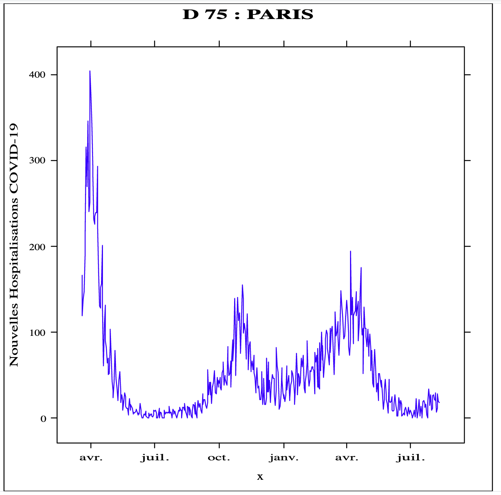

# 03 : Computed Arrays Using Polyglot Proxies 

<div class="inline-container">

<strong>
  Estimated time: 30 minutes
</strong>
</div>


# Objective
The purpose of this lab is to showcase **Java interoperability with guest language types.**

 To do so, we are going to follow the next steps;
*  Manually download a CSV dataset of covid-19 hospitalisation's number per day and departement in France.
*  Create a new Java/Python/R polyglot REST endpoint `/covid19/fr/trends/{departmentId}` to visualize covid trends in the specified departement.
*  The Java REST Controller will rely on a Polyglot Call `( Java -> R)` with ` Java Proxy Arrays` parameters to get the graphics representing the covid-19 trends in the specified department.
*  The controller returns the graphics to be displayed to the browser in `image/svg+xml`format 


# Coding 


The Hospitalization data file is available at [donnees-hospitalieres-covid19-yyyy-mm-yy-HHhMM.csv](https://www.data.gouv.fr/fr/datasets/donnees-hospitalieres-relatives-a-lepidemie-de-covid-19/)
It contains Covid-19  Hospitalization data in France departements starting from  `2020-03-18` to date.
This file is maintained by the French Public Health Agency [`Santé Publique France`](https://www.santepubliquefrance.fr/) . Is file is  updated very frequently (assume a daily basis).

A [stable download URL](https://www.data.gouv.fr/fr/datasets/r/6fadff46-9efd-4c53-942a-54aca783c30c) of the file is provided  as well for automation processes. 

Use the following curl command to download the file through its stable url 
```bash
# Download the latest Hospitalisation dataset from French Public Health Agency

curl -L https://www.data.gouv.fr/fr/datasets/r/6fadff46-9efd-4c53-942a-54aca783c30c -o /tmp/covid-data.csv
```
In this case the file is stored in `/tmp/covid-data.csv`; 
> Keep your destination folder as we will be using this in the next steps.


The file contains quite simple and self explanatory data columns,

``` bash
# dep=Department Identifier, Jour=Date, 
#incid_hosp= Number of peolple hospitalized for covid-19  
# incid_rea: People admited to intensive care in the departement
$ head /tmp/covid-data.csv
"dep";"jour";"incid_hosp";"incid_rea";"incid_dc";"incid_rad"
"01";2020-03-19;1;0;0;0
"01";2020-03-20;0;0;0;1
"01";2020-03-21;3;0;0;0
"01";2020-03-22;3;1;0;1
"01";2020-03-23;14;1;0;5
"01";2020-03-24;11;1;0;4
"01";2020-03-25;13;2;0;5
"01";2020-03-26;14;3;2;2
"01";2020-03-27;14;2;0;0
```

For this lab, we will rely on a set of colums `dep, Date, incid_hosp, incid_rea`
to plot a line graphs that show the evolution of covid-19 hospitalizations in France since over the time . 

```bash
#Download the R script in   03/complete/scripts folder
$cd 03/complete/scripts
$ wget https://raw.githubusercontent.com/nelvadas/helidon-polyglot-demo/master/scripts/covidgraph.R

```


The following R script uses [Lattice](https://cran.r-project.org/web/packages/lattice/index.html) , a popular R graphics library .

* It first reads the dataset in parameters.
*  Assign specific variables for the departement id and  the departemnt  name that are printed on the graphic labels
*  Get the csv file containing the data.
* Print the line graph using `xyplot` function.

```R
require(lattice);

function(param){

#Read parameters
deptId<-param$departmentId
deptName<-param$departmentName
csvFilename<-param$csvFilePath

print(deptId)
print(deptName)
print(csvFilename)


svg();

# vizualization
frdata <- read.table(file=paste(csvFilename) , sep=";", h=TRUE);
names(frdata)
covid_ds = subset(frdata, frdata$dep == deptId)
attach(covid_ds)
#X Format dates in English 
x<-as.Date(jour,format = "%Y-%m-%d")

# y le nombre  d'hospitalisations
y<-incid_hosp

# critical cases
z<-incid_rea

# hospitalisations trends
g1<-xyplot(y~x,type="l", ylab="Nouvelles Hospitalisations COVID-19",col="blue",main=paste(" D ",deptId, ":",deptName )); 
print(g1)
grDevices:::svg.off()
}

```

The R script expects the caller to send a dataframe/ Associative array with the following content
* an array of departement identifier with name `deparmentId`
* an array of department Names with name `departmentName`
* an arry of filenames called `csvFilePath` 


The R file will be use in the Java REST Controller


Edit the application configuration file to add two new properties:.
* `app.covid.data.download.csvfullpath`  to keep the CSV data file location `covid-data.csv`
* `app.covid.rscript`  to store the `covidgraph.R` file location 


## Application Configuration

 Edit the `src/main/resources/META-INF/microprofile-config.properties`
<pre><code>

# Application properties. This is the default greeting
app.greeting=covid19-trends

# Microprofile server properties
server.port=8080
server.host=0.0.0.0

# Turn on support for REST.request SimpleTimers for all JAX-RS endpoints
metrics.rest-request.enabled=true

#  the python script location
app.covid.pyscript=~/Projects/Workshops/EMEA-HOL-GraalVMPolyglot/GraalVM-Polyglot-Labs/03/complete/scripts/department.py

# +++Add a reference to the R Script
<b>app.covid.rscript=~/Projects/Workshops/EMEA-HOL-GraalVMPolyglot/GraalVM-Polyglot-Labs/03/complete/scripts/covidgraph.R</b>

# +++Add the default location of the csv data file 
<b>app.covid.data.download.csvfullpath=/tmp/covid-data.csv</b>
</code></pre>

- add a private instance `rScriptFile` to hold a reference on the R script location
- add a private instance to keep the location of the csv data file `csvLocalFilePath` 
- add the associated `@ConfigProperty` in the Controller constructor for both `rScriptUrl` and `csvLocalFilePath` properties
- create a Source object `rSource` that hold a reference on the R source code 
 


```java
    private Source rSource;
    private String rScriptFile;
    private String csvLocalFilePath;

    private Context polyglot;


    @Inject
    public CovidResource(@ConfigProperty(name = "app.covid.pyscript") String pythonScriptFile,
                         @ConfigProperty(name = "app.covid.rscript") String rScriptUrl, 
                         @ConfigProperty(name = "app.covid.data.download.csvfullpath") String csvLocalFilePath 
                         ) {

        this.pythonScriptFile = pythonScriptFile;
        // Create a private member to keep the R Script location
        this.rScriptFile = rScriptUrl;

        // Create a private member to keep the CSV file path location
        this.csvLocalFilePath = csvLocalFilePath;
        try {

          // Context provides an execution environment for guest languages. 
          // you can pass a list of expected language for this context in the newBuilder Method 
          // R language requires the allowAllAccess flag to be set to true to run .

            this.polyglot = Context.newBuilder().allowAllAccess(true).build();
            this.getDepartmentNameByIdFunc = getPythonDeptFunction();
            this.rSource = Source.newBuilder("R", new File(rScriptFile)).build();
        } catch (Exception e) {
            e.printStackTrace();
        }
    } 

 ```


##  Calling R function from Java

Edit the controller  `src/main/java/com/oracle/graalvm/demos/Covid19Controller.java` 
Add a new endpoint function to retreive the graphics data from R. `/trends/{departmentId}`
The function first computes the departement name by calling the python function,
then, it build a ProxyArray parameter from 
* departement Id
* department name computed from Python 
* csv file path
 and pass it to the R script to retreive the line graph data.


Add a new endpoint to display SVG Data 

```java
   @Path("/trends/{departmentId}")
    @GET
    @Produces({"image/svg+xml"})
    public Response getCovidHospitalisationGraphic(@PathParam("departmentId") String departmentId) {
        // Get the department Name from Python script
        String departmentName = getDepartmentNameByIdFunc.apply(departmentId);
        // Display the covid graph in R for the selected department
        CovidDtoTable.CovidDto[] datas = {new CovidDtoTable.CovidDto(departmentId, csvLocalFilePath, departmentName)};
        CovidDtoTable dataTable = new CovidDtoTable(datas);
        Function<CovidDtoTable, String> rplotFunc = polyglot.eval(rSource).as(Function.class);
        String svgData = rplotFunc.apply(dataTable);
        return Response.ok(svgData).build();
    }
  ```

`dataTable` is a proxy array that mimic data frame type in R.

Proxy interfaces allow to mimic guest language objects, arrays, executables, primitives and native objects in Graal languages.
Every Graal language will treat instances of proxies like an object of that particular language.
Multiple proxy interfaces can be implemented at the same time.

## Simulating the R Data frame type in Java with ProxyArrays

We have to pass a parameter like 
`[ 
     {name=departmentId,values=[]} ,
     {name=departmentName,values=[]},  
     {name=csvFilePath,values=[]} 
 ]` 

to the R script.
Create a new file `src/main/java/com/oracle/graalvm/demos/CovidDtoTable.java` with the following content.
For thus we create a `CovidDtoTable` with three ProxyArray items
* `DepartmentIdProxyArrayColumn`
* `DepartmentNameProxyArrayColumn`
* `CsvFilePathProxyArrayColumn` 

Then implement the methods in the ProxyArray interface `get/set/getSize` 


```java
package com.oracle.graalvm.demos;

import org.graalvm.polyglot.Value;
import org.graalvm.polyglot.proxy.ProxyArray;

public final class CovidDtoTable {

    public DepartmentIdProxyArrayColumn departmentId; // Departnemnt id Array Column
    public DepartmentNameProxyArrayColumn departmentName; // Departnemnt name Array Column
    public CsvFilePathProxyArrayColumn csvFilePath; // csv Datafile  Array Column


    public CovidDtoTable (CovidDto[] dto) {
        this.departmentId= new DepartmentIdProxyArrayColumn(dto);
        this.departmentName= new DepartmentNameProxyArrayColumn(dto);
        this.csvFilePath= new CsvFilePathProxyArrayColumn(dto);

    }

    public static final class CovidDto {
        public String departmentId;
        public String csvFilePath;
        public String departmentName;
        public CovidDto( String departmentId,String csvFilePath, String departmentName) {
            this.departmentId=departmentId;
            this.csvFilePath=csvFilePath;
            this.departmentName=departmentName;
        }

    }

    // Comment
    public static class DepartmentIdProxyArrayColumn implements ProxyArray {
        private final CovidDto[] dto;
        public DepartmentIdProxyArrayColumn(CovidDto[] dto) {
            this.dto = dto;
        }
        public Object get(long index) {
            return dto[(int) index].departmentId;
        }
        public void set(long index, Value value) {
            throw new UnsupportedOperationException();
        }
        public long getSize() {
            return dto.length;
        }
    }


    public static class DepartmentNameProxyArrayColumn implements ProxyArray {
        private final CovidDto[] dto;

        public DepartmentNameProxyArrayColumn(CovidDto[] dto) {
            this.dto = dto;
        }

        public Object get(long index) {
            return dto[(int) index].departmentName;
        }

        public void set(long index, Value value) {
            throw new UnsupportedOperationException();
        }

        public long getSize() {
            return dto.length;
        }
    }

    public static class CsvFilePathProxyArrayColumn implements ProxyArray {
        private final CovidDto[] dto;

        public CsvFilePathProxyArrayColumn(CovidDto[] dto) {
            this.dto = dto;
        }

        public Object get(long index) {
            return dto[(int) index].csvFilePath;
        }

        public void set(long index, Value value) {
            throw new UnsupportedOperationException();
        }

        public long getSize() {
            return dto.length;
        }
    }


}
```


## Testing 

Run the application from your prefered browser [http://localhost:8080/covid19/fr/trends/75](http://localhost:8080/covid19/fr/trends/75)
if the helidon Dev loop is not enabled, build and start the application first 
```shell
# build and run 
$ mvn clean install 
$ java -jar target/covid19-trends.jar
```
Open the newly created endpoint from your web browser.  http://localhost:8080/covid19/fr/trends/75
The covid trends for *Paris* should be available .




## Quiz

1. While creating the initial Polyglot Context we used the following instruction  `this.polyglot = Context.newBuilder().allowAllAccess(true).build();`
For which language the `allowAllAccess=true` is required?  
2. how is the trend in the department whose id is the next LTS Java Version (Coming in September 2021)
<details><summary>Solution</summary>
<p>
1. language  R 

2. The next java LTS planned for September 2021 is `Java 17` ; [http://localhost:8080/covid19/fr/trends/17](http://localhost:8080/covid19/fr/trends/17)


</p>
</details>

## Summary
In this labs, you built and run polyglot application running Java, Javascript , R and Python
You used Proxy Arrays to simulate R dataframes. 
Congratulations for completing this lab :1st_place_medal:	:trophy:	

## Resources 
* [Proxy Array Interface ](https://docs.oracle.com/en/graalvm/enterprise/20/sdk/org/graalvm/polyglot/proxy/ProxyArray.html)
