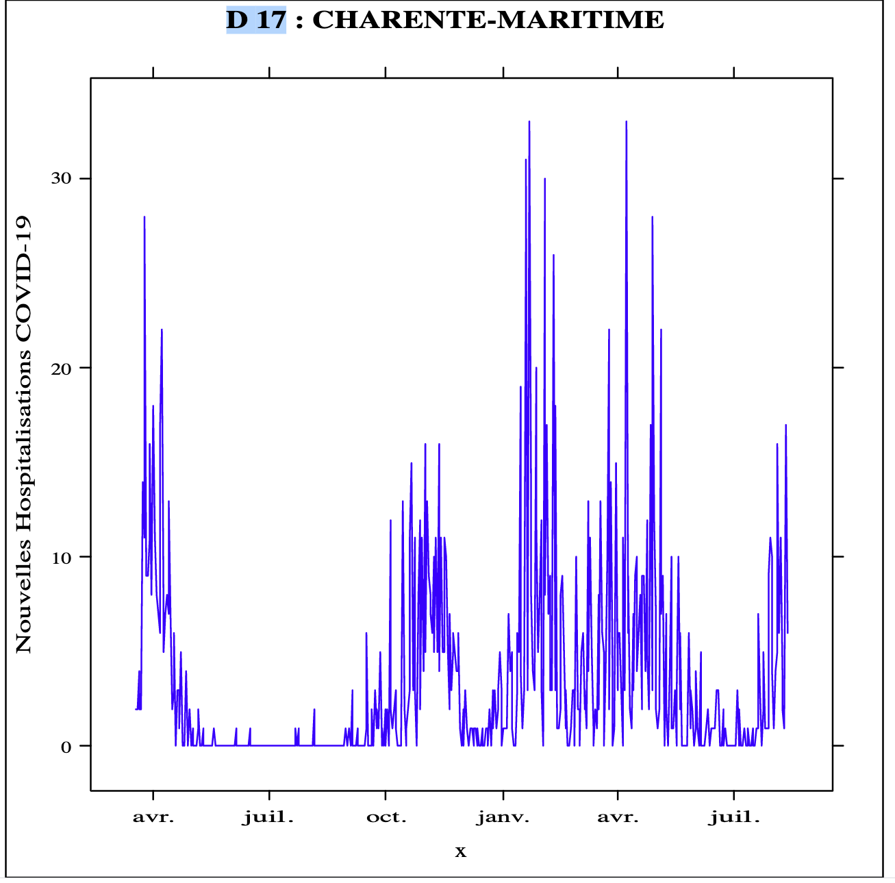

# 03 : Computed Arrays Using Polyglot Proxies 

<div class="inline-container">

<strong>
  Estimated time: 30 minutes
</strong>
</div>


# Objective
* customize Java interoperability by mimicking guest language types 
* Call a R functions with custom parameters from a Java program
 


# Todo 
In the folowing lab, you will have to :
*  Manually download the dataset
*  Use an R library to plot Covid Trends for a specific departement
*  Create a new Java/Python polyglot REST endpoint `/covid19/fr/trends/{departmentId}` to visualize covid trends in the specified departement.
* Use Porxies Array to mimic R Dataframe Types.


# Coding 


```bash
# Download the latest Hospitalisation dataset from French National Health Agency

curl -L https://www.data.gouv.fr/fr/datasets/r/6fadff46-9efd-4c53-942a-54aca783c30c -o /tmp/covid-data.csv
```


Explore the file structure 
``` bash
# dep=Department Identifier, Jour=Date, 
#incid_hosp= Number of peolple admitted in hospital 
# incid_rea: People in critical state in the departement
$ head /tmp/covid-data.csv
"dep";"jour";"incid_hosp";"incid_rea";"incid_dc";"incid_rad"
"01";2020-03-19;1;0;0;0
"01";2020-03-20;0;0;0;1
"01";2020-03-21;3;0;0;0
"01";2020-03-22;3;1;0;1
"01";2020-03-23;14;1;0;5
"01";2020-03-24;11;1;0;4
"01";2020-03-25;13;2;0;5
"01";2020-03-26;14;3;2;2
"01";2020-03-27;14;2;0;0
```
The most important column we will be using in this file are `dep, Date, incid_hosp, incid_rea``


```bash
#Download the R script in   03/complete/scripts folder
$cd 03/complete/scripts
$ wget https://raw.githubusercontent.com/nelvadas/helidon-polyglot-demo/master/scripts/covidgraph.R

```

Explore the R script
```R
require(lattice);

function(param){

#Read parameters
deptId<-param$departmentId
deptName<-param$departmentName
csvFilename<-param$csvFilePath

print(deptId)
print(deptName)
print(csvFilename)


svg();

# vizualization
frdata <- read.table(file=paste(csvFilename) , sep=";", h=TRUE);
names(frdata)
covid_ds = subset(frdata, frdata$dep == deptId)
attach(covid_ds)
#X contient les dates
x<-as.Date(jour,format = "%Y-%m-%d")

# y le nombre  d'hospitalisations
y<-incid_hosp

# z le nombre de réanimation
z<-incid_rea
# Courbe des hospitalisations 

g1<-xyplot(y~x,type="l", ylab="Nouvelles Hospitalisations COVID-19",col="blue",main=paste(" D ",deptId, ":",deptName )); 
print(g1)
grDevices:::svg.off()
}

```

The R script expect the caller to send a dataframe/ Associative array that contains 
* an array of departement identifier with name `deparmentId`
* an array of department Names with name `departmentName`
* an arry of filenames called `csvFilePath` 


## Application Configuration

 Edit the `src/main/resources/META-INF/microprofile-config.properties`
```bash

# Application properties. This is the default greeting
app.greeting=covid19-trends

# Microprofile server properties
server.port=8080
server.host=0.0.0.0

# Turn on support for REST.request SimpleTimers for all JAX-RS endpoints
metrics.rest-request.enabled=true

# Add the python script location
app.covid.pyscript=~/Projects/Workshops/EMEA-HOL-GraalVMPolyglot/GraalVM-Polyglot-Labs/03/complete/scripts/department.py

# Add a reference to the R Script
app.covid.rscript=~/Projects/Workshops/EMEA-HOL-GraalVMPolyglot/GraalVM-Polyglot-Labs/03/complete/scripts/covidgraph.R

# Add the default location of the csv data file 
app.covid.data.download.csvfullpath=/tmp/covid-data.csv
```


## Simulating the R Dataframe type in Java with ProxyArrays

We have to pass a parameter like [{name=departmentId,values=[]},{name=departmentName,values=[]},{name=csvFilePath,values=[]} ] to the R script.
Create a new file `src/main/java/com/oracle/graalvm/demos/CovidDtoTable.java` with the following content.
For thus we create a `CovidDtoTable` with three ProxyArray items
* `DepartmentIdProxyArrayColumn`
* `DepartmentNameProxyArrayColumn`
* `CsvFilePathProxyArrayColumn` 

Then implement the methods in the ProxyArray interface `get/set/getSize` 


```java
package com.oracle.graalvm.demos;

import org.graalvm.polyglot.Value;
import org.graalvm.polyglot.proxy.ProxyArray;

public final class CovidDtoTable {

    public DepartmentIdProxyArrayColumn departmentId;
    public DepartmentNameProxyArrayColumn departmentName;
    public CsvFilePathProxyArrayColumn csvFilePath;


    public CovidDtoTable (CovidDto[] dto) {
        this.departmentId= new DepartmentIdProxyArrayColumn(dto);
        this.departmentName= new DepartmentNameProxyArrayColumn(dto);
        this.csvFilePath= new CsvFilePathProxyArrayColumn(dto);

    }

    public static final class CovidDto {
        public String departmentId;
        public String csvFilePath;
        public String departmentName;
        public CovidDto( String departmentId,String csvFilePath, String departmentName) {
            this.departmentId=departmentId;
            this.csvFilePath=csvFilePath;
            this.departmentName=departmentName;
        }

    }

    public static class DepartmentIdProxyArrayColumn implements ProxyArray {
        private final CovidDto[] dto;
        public DepartmentIdProxyArrayColumn(CovidDto[] dto) {
            this.dto = dto;
        }
        public Object get(long index) {
            return dto[(int) index].departmentId;
        }
        public void set(long index, Value value) {
            throw new UnsupportedOperationException();
        }
        public long getSize() {
            return dto.length;
        }
    }


    public static class DepartmentNameProxyArrayColumn implements ProxyArray {
        private final CovidDto[] dto;

        public DepartmentNameProxyArrayColumn(CovidDto[] dto) {
            this.dto = dto;
        }

        public Object get(long index) {
            return dto[(int) index].departmentName;
        }

        public void set(long index, Value value) {
            throw new UnsupportedOperationException();
        }

        public long getSize() {
            return dto.length;
        }
    }

    public static class CsvFilePathProxyArrayColumn implements ProxyArray {
        private final CovidDto[] dto;

        public CsvFilePathProxyArrayColumn(CovidDto[] dto) {
            this.dto = dto;
        }

        public Object get(long index) {
            return dto[(int) index].csvFilePath;
        }

        public void set(long index, Value value) {
            throw new UnsupportedOperationException();
        }

        public long getSize() {
            return dto.length;
        }
    }


}
```


##  Calling R function from Java

Edit the controller  `src/main/java/com/oracle/graalvm/demos/Covid19Controller.java` 
 with the following code 


 *  Add a private instance `rScriptFile` to hold a reference on the R script
 *  `rSource` hold a reference on the source object 
 *  add a properties to keep the location of the csv data file `csvLocalFilePath` 
 *

```java
    private Source rSource;
    private String rScriptFile;
    private String csvLocalFilePath;

    private Context polyglot;


    @Inject
    public CovidResource(@ConfigProperty(name = "app.covid.pyscript") String pythonScriptFile,
                         @ConfigProperty(name = "app.covid.rscript") String rScriptUrl,
                         @ConfigProperty(name = "app.covid.data.download.csvfullpath") String csvLocalFilePath) {

        this.pythonScriptFile = pythonScriptFile;
        this.rScriptFile = rScriptUrl;
        this.csvLocalFilePath = csvLocalFilePath;
        try {
            this.polyglot = Context.newBuilder().allowAllAccess(true).build();
            this.getDepartmentNameByIdFunc = getPythonDeptFunction();
            this.rSource = Source.newBuilder("R", new File(rScriptFile)).build();
        } catch (Exception e) {
            e.printStackTrace();
        }
    } 

 ```


Add a new endpoint to display SVG Data 

```java
   @Path("/trends/{departmentId}")
    @GET
    @Produces({"image/svg+xml"})
    public Response getCovidHospitalisationGraphic(@PathParam("departmentId") String departmentId) {
        // Get the department Name from Python script
        String departmentName = getDepartmentNameByIdFunc.apply(departmentId);
        // Display the covid graph in R for the selected department
        CovidDtoTable.CovidDto[] datas = {new CovidDtoTable.CovidDto(departmentId, csvLocalFilePath, departmentName)};
        CovidDtoTable dataTable = new CovidDtoTable(datas);
        Function<CovidDtoTable, String> rplotFunc = polyglot.eval(rSource).as(Function.class);
        String svgData = rplotFunc.apply(dataTable);
        return Response.ok(svgData).build();
    }
  ```


Run the application from your  browser/Terminal 
if the helidon Dev loop is not enabled, 
Build and start the application using 
```shell
# build and run 
mvn clean install 
java -jar target/covid19-trends.jar
```

Opent the newly created endpoint from your web browser.  http://localhost:8080/covid19/fr//trends/75
The covid trends for Paris should be available 


## Quiz

1. While creating the initial Polyglot Context we used the following instruction  `this.polyglot = Context.newBuilder().allowAllAccess(true).build();``
For which language the `allowAllAccess=true` is required?  
2. how is the trend in the department whose id is the next LTS Java Version (Coming in September 2021)
<details><summary>Solution</summary>
<p>
1. language  R 

2. Java 17 ; 17=> Charentes  Maritimes 

</p>
</details>

## Summary
In this labs, you build and run Polyglot Application running Java, Javascript , R and Python
You used Proxy Arrays to simulate R Dataframes


