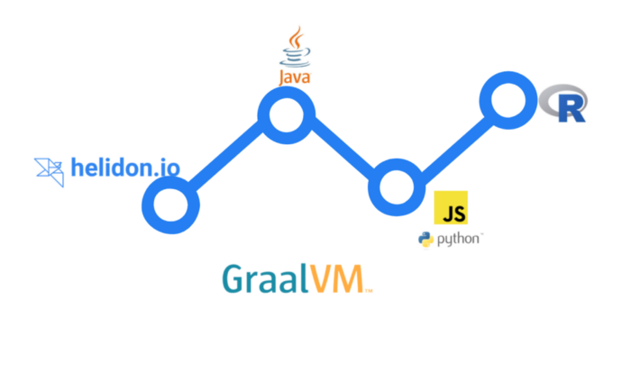

# GraalVM Polyglot Labs

## Introduction 

The purpose of this lab is to build a complete Polyglot Microservice application 
with Java, Javascript, Python and R to visualise the covid-19 trends in a French Department
The application provides a couple of REST Helidon endpoint that enables users to visualize a Covid-19 evolution in France, 
This application relies on data provided by the French National Health Agency [Santé Publique France](https://www.data.gouv.fr/fr/datasets/donnees-hospitalieres-relatives-a-lepidemie-de-covid-19/).

## Stack

## Agenda

* [LAB 01: Building a Simple GraalVM Polyglot Application](./01/README.md)
* [LAB 02: Interacting with Guest Language resources](./02/README.md)
* [LAB 03: Computed Arrays Using Polyglot Proxies](./03/README.md)

## Resources
*  The lab is built from the full example https://github.com/nelvadas/helidon-polyglot-demo
*  GraalVM Polyglot Reference Manual https://www.graalvm.org/reference-manual/embed-languages/
*  Full Blog post on [Medium](https://medium.com/@nelvadas/polyglot-micro-service-for-visualizing-covid-19-trends-with-graalvm-helidon-java-r-python-c-a3dce4262eb3) 
* Dataset https://www.data.gouv.fr/fr/datasets/r/6fadff46-9efd-4c53-942a-54aca783c30c